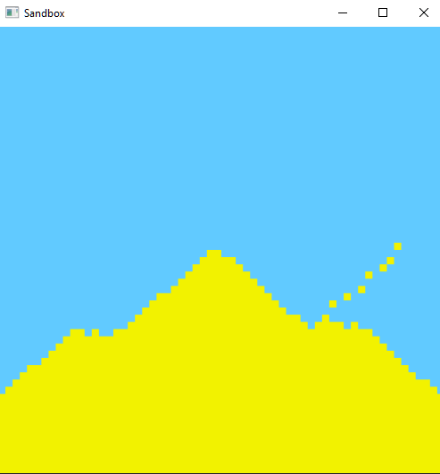

# Sandbox
Sand Simulator/Cellular Automaton written in Go using [Ebiten](https://github.com/hajimehoshi/ebiten)

## Instructions

1. Clone the project: `git clone https://github.com/SnkSynthesis/sandbox`
2. Change directory to `sandbox/`: `cd sandbox/`
3. Run `go run sandbox.go` or run `go build` and then `./sandbox`

Once window is open one can do the following:

* `[Space]` Or `[Resizing Window]` - Clears all sand
* `[Left-Click]` - Places sand
* `[Right-Click]` - Removes sand

Enjoy!
